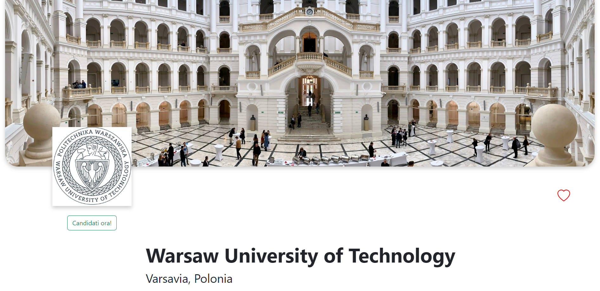
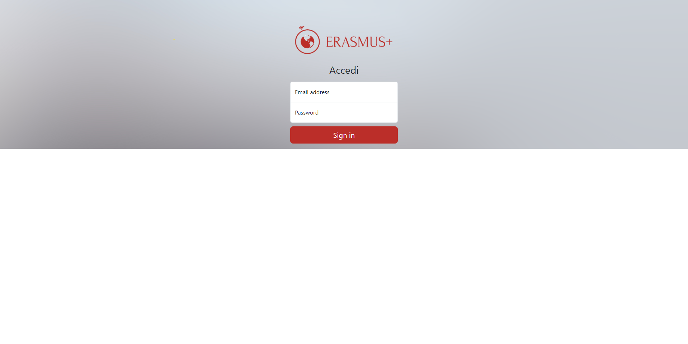

# ErasmusPlus ✈️

`Erasmus Plus` is a web application that is conceived for being integrated in an existing university's website for allowing students to apply for the Erasmus+ programme,
and making administrators able to manage all the applications and the Erasmus+ offers. This project is developed for academic purposes for the course `Applicazioni e Servizi Web` of `University of Bologna` under the academic year 2022/2023.

## Web Application Overview

<div style="display: flex; justify-content: space-around;">
  
  
</div>
<div style="display: flex; justify-content: space-around;">
  
  
</div>

## Installation

For installing all the required dependencies you need to execute the following steps:

- Clone the repo
- Open a shell in the root of the project
- Execute the following commands:

```console
$ cd client/
$ npm install
$ cd ..
$ cd server/
$ npm install
```

## Execution

With a shell opened in the root of the project execute the following commands:

```console
$ cd server/
$ npm start
$ cd ..
$ cd client/
$ npm run dev
```

Now it's possible to connect to the website at the following URL: http://localhost:5173/

## Authors

- Filippo Venturini 
- Alberto Di Girolamo
- Pietro Lelli
